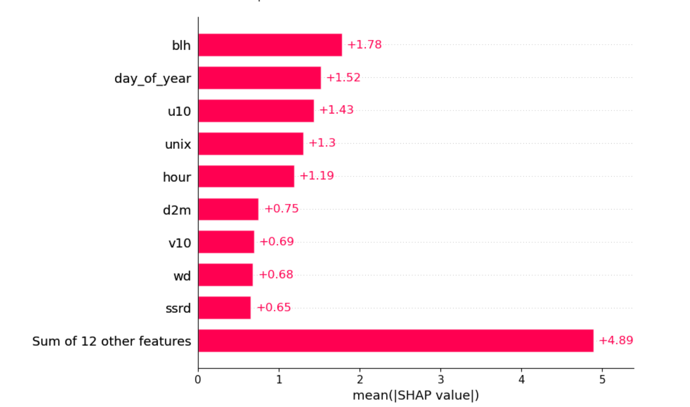

# Time-series-analytics-course

<p align="center">
  
  
  
</p>

# Table of contents
1. [Course overview](#Course-overview)
2.  [Running the models](#Running)
     * 2a. [Using your own machine](#own)
     * 2b. [Using Google Colab](#Colab)
     * 2c. [Using Docker](#Docker)
4. [Folder structure and running the examples](#Folder-Structure)
5. [Expectations and pace of learning](#Expectations)
6. [Code of Conduct](#Code-of-Conduct)

## 1) Course overview<a name="Course-overview"></a>

This short course was designed as an introduction to using the Python ecosystem for generating insights from time series datasets. We provide particular attention to air-quality and meteorological datasets using 4 Jupyter notebooks; one for each day of the course. 

<p align="center">
  
</p>


Time-series data and associated methods for generating insights is a huge area of research. We do not cover many methods here, rather provide a starting point from which a user could become comfortable with the general Python ecosystem whilst moving towards methods that include machine learning and GiS. 

## 2). Running the models<a name="Running"></a>

If you have not used a Jupyter notebook before, I would reccomend checking out the official [webpage](https://jupyter.org/). There are multiple ways you can interact with a Jupyter notebook. The most flexible way is to open and interact with them on your own computer. However you can start an instance of every notebook running in the cloud. We provide details below

### 2(a). Using your own machine<a name="own"></a>

Having a Python distribution on your own machine is attractive for a number of reasons, not least gaining familiarity with building projects in your own time. If you havent already, I would reccomend installing the Anaconda distribution. You can download a copy using [this link](https://www.anaconda.com/products/individual). That page will give you the option to download a version for Windows, Mac or Linux. Download the graphical installer and, typically, accept all options. Once you have installed this, now open a terminal. On Windows, go to the menu of options and find 'Anaconda Prompt' under the Anaconda folder. On a Mac, go to Finder -> Utilities -> Terminal. If on a Mac, when in this terminal when you type:

> Python

Do you see the reference to Anaconda? For example, you may see something *similar* to:

> Python 3.7.6 (default, Jan  8 2020, 20:23:39) [MSC v.1916 64 bit (AMD64)] :: Anaconda, Inc. on win32

#### Getting a copy of the course repository

##### 🔄 Cloning the Project and Working with Git

To use this project and save your notebook work, you'll need to **clone the repository to your local machine**. You can do this using **GitHub Desktop** (recommended for beginners) or the command line.

---

##### 🖥️ Option 1: Using GitHub Desktop

1. Download and install [GitHub Desktop](https://desktop.github.com/).
2. Open GitHub Desktop and click **"File → Clone Repository..."**.
3. In the "GitHub.com" tab, find this repository and click **"Clone"**.
4. Choose a local folder where you'd like to store the project.

You now have a local copy of the project on your machine.

---

##### 💻 Option 2: Using the Command Line

If you prefer the terminal, you can run:

```bash
git clone https://github.com/yourusername/your-repo.git
cd your-repo
```

Now we are going to create a virtual environment to run our notebooks in. Virtal environments are a great way of maintaining a 'work space' that is seperate to your default installation. For example, if you are going to start installing lots of bespoke modules, you may sometimes come across a clash of version numbers which then becomes tricky to maintain. In the worst case scenario, this would require a re-installation of Python. So lets create a virtual environment for our project. You can switch-on and switch-off these virtual environments from the command line/terminal whenever you need them.

If you are on Windows, go back to the Anaconda prompt. If you are on a Mac or Linux, go back to ther terminal. Once you have the project downloaded, open a command prompt/terminal and navigate to the project folder. We are now going to use the file 'environment.yml' to create a new virtual environment. Run the following command:

> conda env create -f environment.yml

You will see a number of packages being downloaded by the conda package manager which is part of the Anaconda distribution. Accept any requests and, when finished, you will see a message that resembles the following:

    To activate this environment, use
    
        $ conda activate timeseries
    
    To deactivate an active environment, use
    
        $ conda deactivate
        
These are the commands for switching on/off this new virtual environment. Let's switch it on. Type the following in the command prompt/terminal:

> conda activate timeseries

In the command prompt, you will see the name (EnvModelling) replace (base). Now we can start an interactive Jupyer notebook session. Still within the project folder, type the following:

> jupyter notebook

Can you see the project folders and files? You are good to go! Every time you now want to open the notebooks for this project, open either the Anaconda prompt or Terminal, activate the environment and then run the last command from within the project folder.

### 2(b). Using Google Colab<a name="Colab"></a>

Google's Colab [Co-laboratory](https://colab.research.google.com) is a great platform for developing machine learning and data-science driven applications on the web. It provides access to free GPU resource (Graphics Processing Units). However it also allows us to run Jupyter notebooks from a Github repository *if you have a Google account*. If you can register or have an existing Google account, using Google Colab is a really nice experience. It will allow you to save individual files and projects to your Google Drive. We dont cover that here. By clicking on the above link it will take you to a page that presents you with options to load existing files from either your Google Drive or from public repositories. However we also provide you with a notebook that will setup all of the files on your Google drive. This can be run by clicking on the link below. This clones the current respository to your drive and sets up the pre-trained XGBoost model files so you can call them as you would running on your local machine:

#### Setting up on Google Colab
- [](https://colab.research.google.com/github/m-edal/Time-series-analytics-course/blob/main/Setup_GoogleColab.ipynb)

Once you have run this file, you can then access your notebook files from your Google drive, modify them and save them for continual development. We will cover this in class.

### 2(c). Using Docker <a name="Docker"></a>

#### 🚀 Running the Jupyter Environment with Docker

You can use Docker to interact with the course material. This requires the following prerequisites:

- [Docker](https://www.docker.com/products/docker-desktop/) installed
- [Docker Compose](https://docs.docker.com/compose/) installed
- Git installed (most easily installed as Github desktop)

#### 🧰 Setup Instructions

c.1) **Clone this repository** to your local machine. If you are using a terminal to do this, open a terminal and write:

   ```bash
   git https://github.com/m-edal/Time-series-analytics-course.git
   cd Time-series-analytics-course
   ```
   Alternatively you can use the [Github desktop  GUI]() installed on your machine.

c.2 ) **Build the Docker image**. Navigate to where you cloned this repository and open a terminal. Enter the following:

   ```bash
   docker-compose build
   ```
   You will see various things progressing on the screen. Wait until this finished. 
   
c.3) **Start the Jupyter Lab server**. In the same terminal, you are now going to start the Docker server by typing the following command:

   ```bash
   docker-compose up
   ```

c.4) Now **Open your web browser and go to**:

  ```arduino
  http://localhost:8888
  ```
Jupyter will open without requiring a login, and you’ll see the contents of the project directory.

💾 Where Your Work is Saved
All notebooks and files you create or edit in Jupyter are saved to your local project folder. This is enabled via Docker volume mapping (.:/workspace), so your work is not lost when the container stops.

#### How to Shut It Down
To stop the server:
 - If running in the foreground (you used **docker-compose up**), press:

 ```mathematica
 Ctrl + C
 ```
in the same terminal.

 - If running in the background (you used **docker-compose up -d**), run:

  ```bash
  docker-compose down
  ```
This stops and removes the container, but your files stay safely on your machine.


## 4) Repository structure and using Jupyter notebooks <a name="Folder-Structure"></a>

    .                           # Root folder of our repository
    ├── images                  # Contains images for all notebooks
    ├── data               # Contains the same notebooks as in our root folder but with solutions
    |------ AURN                # images used in solutions notebooks
    |------ Reanalysis          # Reanalysis met data
    |------ Supersite           # Air quality supersite data
    ├── Practical 1 -           # Individual notebook practicals
    ├── Practical 2. ....
    ├── LICENSE
    └── README.md
    
## 5) Expectations and pace of learning<a name="Expectations"></a>

We cant teach everything Python or any programming language has to offer in this course, but we can given you a set of tools to begin your journey into the wonderful world of programming and data analysis in aerosol science. Please note that you should not feel pressured to complete every exercise in class. These practicals are designed for you to take outside of class and continue working on them. Proposed solutions to all exercises can be found in the 'solutions' folder. After reading the instructions and aims of any exercise, search the code snippets for a note that reads ------'INSERT CODE HERE'------ to identify where you need to write your code. These are often proposed solutions and you may have your own way of solving then. That is fine! Quite often in programming there are many ways to 'cut the cloth'. In this course we will not cover optimisation but try to stick to a 'Pythonic' way of solving things without sacrificing your learning path. 
    
## 6) Code of Conduct<a name="Code-of-Conduct"></a>

Please note that this project is released with a Contributor Code of Conduct. By participating in this project you agree to abide by its [terms](code-of-conduct.md). 

## Disclaimer

THIS SOFTWARE IS PROVIDED BY THE COPYRIGHT HOLDERS AND CONTRIBUTORS “AS IS” AND ANY EXPRESS OR IMPLIED WARRANTIES, INCLUDING, BUT NOT LIMITED TO, THE IMPLIED WARRANTIES OF MERCHANTABILITY AND FITNESS FOR A PARTICULAR PURPOSE ARE DISCLAIMED. IN NO EVENT SHALL THE COPYRIGHT OWNER OR CONTRIBUTORS BE LIABLE FOR ANY DIRECT, INDIRECT, INCIDENTAL, SPECIAL, EXEMPLARY, OR CONSEQUENTIAL DAMAGES (INCLUDING, BUT NOT LIMITED TO, PROCUREMENT OF SUBSTITUTE GOODS OR SERVICES; LOSS OF USE, DATA, OR PROFITS; OR BUSINESS INTERRUPTION) HOWEVER CAUSED AND ON ANY THEORY OF LIABILITY, WHETHER IN CONTRACT, STRICT LIABILITY, OR TORT (INCLUDING NEGLIGENCE OR OTHERWISE) ARISING IN ANY WAY OUT OF THE USE OF THIS SOFTWARE, EVEN IF ADVISED OF THE POSSIBILITY OF SUCH DAMAGE.
